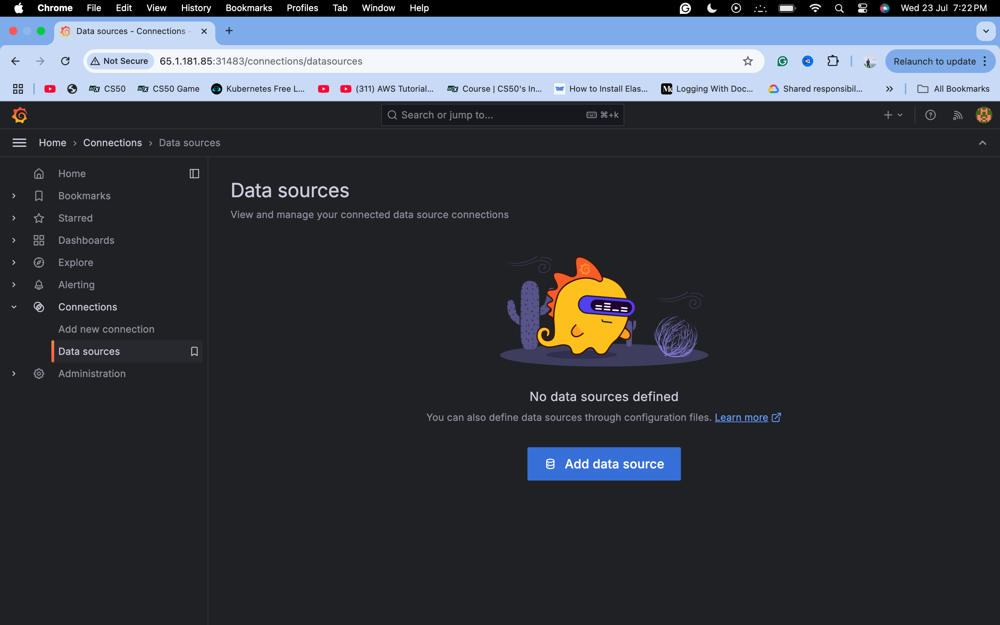
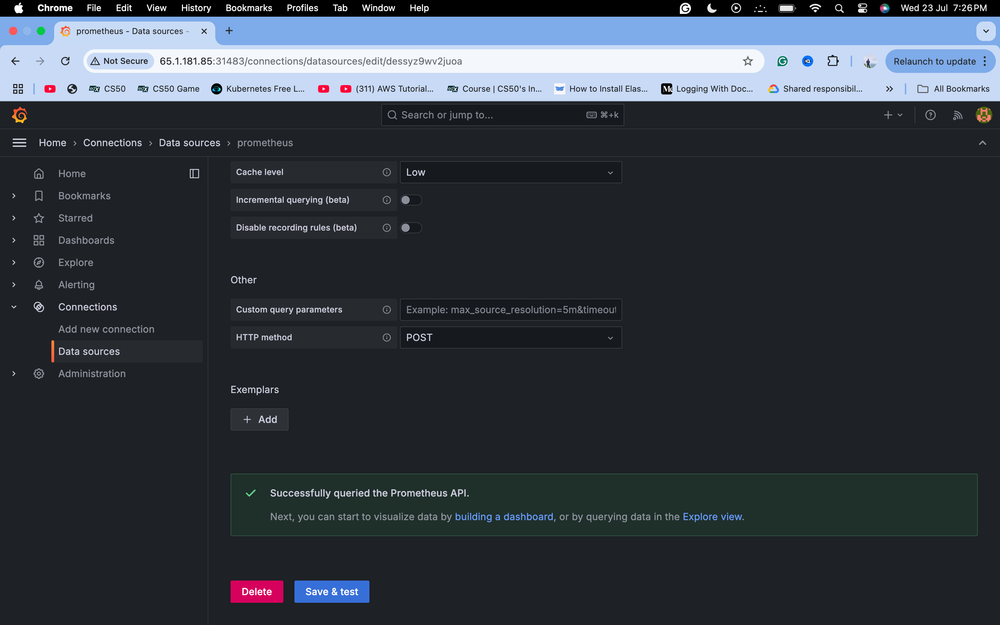

# 📊 EKS Monitoring Setup with Prometheus & Grafana

This project demonstrates how to monitor your **EKS (Elastic Kubernetes Service)** cluster using **Prometheus** and **Grafana**, deployed via **Helm**, with services exposed using `NodePort`.

---

## 🔧 Prerequisites

- AWS EKS Cluster
- `kubectl` configured for your EKS cluster
- `helm` installed
- AWS CLI configured

---

## 🚀 Installation Steps

### 1. Create Namespace

```bash
kubectl create namespace monitoring
```

---

### 2. Install Prometheus

```bash
helm install prometheus prometheus-community/prometheus \
  --namespace monitoring \
  --set server.persistentVolume.enabled=false \
  --set alertmanager.persistentVolume.enabled=false
```

  
📦 Prometheus installation response:  


---

### 3. Patch Prometheus Service to NodePort

```bash
kubectl patch svc prometheus-server -n monitoring \
  -p '{"spec": {"type": "NodePort"}}'
```

---

### 4. Install Grafana with Helm

```bash
helm install grafana grafana/grafana \
  --namespace monitoring \
  --set persistence.enabled=false \
  --set adminPassword='admin' \
  --set service.type=NodePort
```

  
📦 Grafana installation response:  


---

## 🧪 Verify Installations

### Check Pods in `monitoring` Namespace

```bash
kubectl get pods -n monitoring
```


---

### Check Services in `monitoring` Namespace

```bash
kubectl get svc -n monitoring
```


---

## 🌐 Access Grafana

> Use the public IP of any node along with the `NodePort` exposed by the Grafana service.  
> Example: `http://61.1.181.85:31483`

### Login Credentials

- **Username**: `admin`
- **Password**: `admin`


---

## ⚙️ Configure Prometheus as a Data Source in Grafana

1. Go to **Connections → Data Sources**
2. Click **Add Data Source**
3. Choose **Prometheus**
4. Enter the following URL:

```
http://prometheus-server.monitoring.svc.cluster.local
```

5. Click **Save & Test**

  
  


---

## 📈 Import EKS Monitoring Dashboard

1. Go to **Dashboards → Import**
2. Use **Dashboard ID**: `15757`
3. Click **Load**

  


4. Select the Prometheus datasource created earlier


✅ Your EKS monitoring dashboard should now be visible:


---

## 📌 Summary

You have successfully:

- Deployed Prometheus & Grafana in EKS using Helm
- Configured monitoring namespace and services
- Connected Grafana to Prometheus
- Imported a ready-made EKS dashboard

Feel free to fork this repo, contribute improvements, or use it as a boilerplate for your own cluster observability setup!

---

📸 *All screenshots are available in the `screenshots/` folder for reference.*
